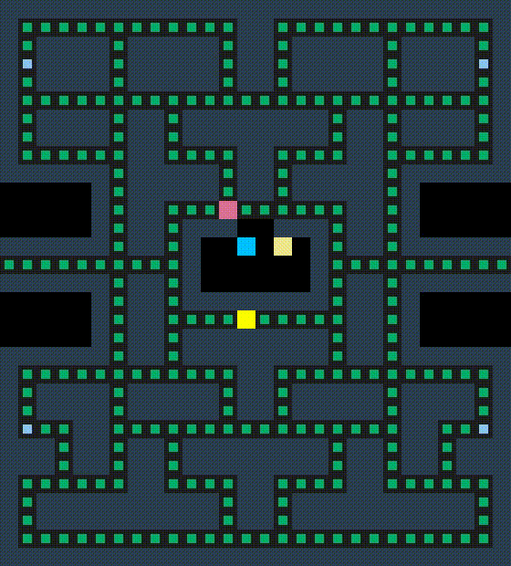

# CPPND: Capstone PacMan Game Example

This is a repository for the Capstone project in the [Udacity C++ Nanodegree Program](https://www.udacity.com/course/c-plus-plus-nanodegree--nd213). The code for this repo was inspired by [this](https://engineering.purdue.edu/OOSD/F2009/Assignments/IPA/pacman.html) excellent instruction and [this](https://github.com/tkilminster/pacman) repository.

## Feature

### Available Map status
- kFree: Free Space
- kFood: Food can be eaten, +20 score
- kPill: Pill can be eaten, +50 score, PacMan can be powered for 10 seconds
- kWall: Wall Space, which can not be accoss by Ghost and PacMan

### Available Ghost Colour
- kRed: Blinky
- kBlue: Inky
- kYellow: Clyde
- kPink: Pinky

### Available Ghost Mode
- kChase: Ghost follow pacman
- kScatter: Ghost circle at corner
- kFrighten: Ghost will slow down and vulnerable when PacMan eats pill
- kDeath: Ghost be eaten by PacMan when Ghost in kFrighten mode

### Available Movement
- kUp
- kDown
- kLeft
- kDown

## How to Play
- Keyboard Up: Move Up
- Keyboard Down: Move Down
- keyboard Left: Move Left
- Keyboard Right: Move Right
- Keyboard CTRL + C: Exit Game 

## Dependencies for Running Locally
* cmake >= 3.7
  * All OSes: [click here for installation instructions](https://cmake.org/install/)
* make >= 4.1 (Linux, Mac), 3.81 (Windows)
  * Linux: make is installed by default on most Linux distros
  * Mac: [install Xcode command line tools to get make](https://developer.apple.com/xcode/features/)
  * Windows: [Click here for installation instructions](http://gnuwin32.sourceforge.net/packages/make.htm)
* SDL2 >= 2.0
  * All installation instructions can be found [here](https://wiki.libsdl.org/Installation)
  * Note that for Linux, an `apt` or `apt-get` installation is preferred to building from source.
* gcc/g++ >= 5.4
  * Linux: gcc / g++ is installed by default on most Linux distros
  * Mac: same deal as make - [install Xcode command line tools](https://developer.apple.com/xcode/features/)
  * Windows: recommend using [MinGW](http://www.mingw.org/)

## Basic Build Instructions

1. Clone this repo.
2. Make a build directory in the top level directory: `mkdir build && cd build`
3. Compile: `cmake .. && make`
4. Run it with optional user defined maze: `./PacMan [path-to-maze-file]`.

## Software Architecure
The software architecure of project is shown as follows:

## Matched Project Rubric
The matched project rubric is shown as follows:

### Loops, Functions, I/O
| Criteria | Meets Specifications |
| -------- | -------------------- |
| The project demonstrates an understanding of C++ functions and control structures. | All function are enclusption into class Game, Agent, PacMan, Ghost, Controller, Map, Renderer |
| The project reads data from a file and process the data, or the program writes data to a file. | Path of map file can be load to initalize local file (map.cpp line 17 - 55) |
| The project accepts user input and processes the input. | Path of map file can be given to Program via comandline (main.cpp line 15 - 24). |

### Object Oriented Programming
| Criteria | Meets Specifications |
| -------- | -------------------- |
|The project uses Object Oriented Programming techniques. | class Game, Agent, PacMan, Ghost, Controller, Map, Renderer |
| Classes use appropriate access specifiers for class members. | class Game, Agent, PacMan, Ghost, Controller, Map, Renderer |
| Class constructors utilize member initialization lists. | Class Game, Agent, Map |
| Classes abstract implementation details from their interfaces.| Documentation in class Game, Agent, PacMan, Ghost, Controller, Map, Renderer |
| Classes follow an appropriate inheritance hierarchy. | class PacMan and Ghost inherited from class Agent |
| Overloaded functions allow the same function to operate on different parameters.| pacman.cpp Intialize() override line 31, ghost.cpp Initialize() override line 48|
| Derived class functions override virtual base class functions.| pacman.cpp Intialize() override line 31, ghost.cpp Initialize() override line 48|
